# HTB Cyber Apocalypse 2024 Hacker Royale - Forensics - Phreaky

## Summary:
*In the shadowed realm where the Phreaks hold sway,*  
*A mole lurks within, leading them astray.*  
*Sending keys to the Talents, so sly and so slick,*  
*A network packet capture must reveal the trick.*  
*Through data and bytes, the sleuth seeks the sign,*  
*Decrypting messages, crossing the line.*  
*The traitor unveiled, with nowhere to hide,*  
*Betrayal confirmed, they'd no longer abide.*

The Phreaky challenge is a Medium difficulty exercise that challenges your knowledge of network traffic analysis and file forensics. A mole has disclosed the Phreaks planning document to the Talents, and intends to make it difficult to be tracked by splitting up the document into 15 parts, archiving each into 15 .zip files. 

The pcap file does not contain much noise (3.5k packets is barely a lot), and the main application utilised for "mole" activities is email. 

## Steps:
**1. Protocol Analysis**   
Investigate the given pcap file using Wireshark. First check the protocol hierarchy. Note that majority of the traffic is TCP -> made of SMTP, TLS and HTTP.   
   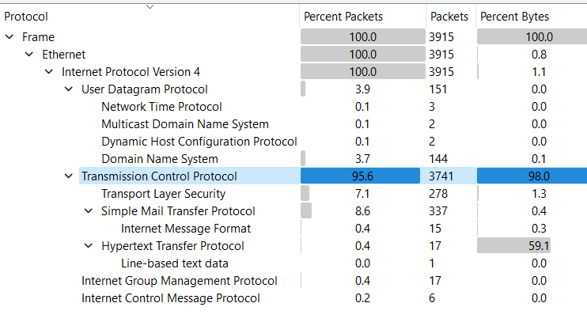  


 **2. Checking HTTP**   
 Let's start with filtering the HTTP traffic. There does not seem to be anything interesting. This is likely a normal Ubuntu package update. We will skip this protocol.   
   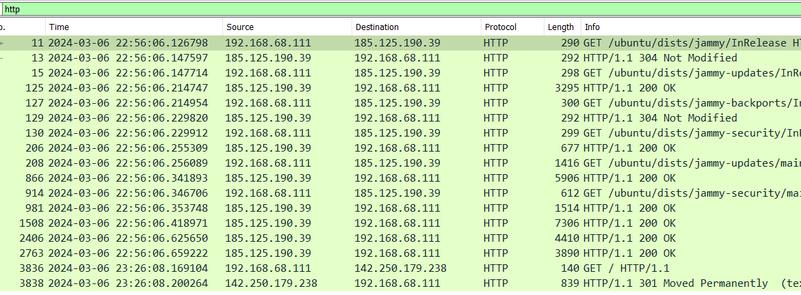  

**3. TLS**  
 Right now, there would be no point sifting through TLS as we do not have a key to decrypt this traffic. However, from some of its ASCII output when we follow stream we have a context that it's related to an email server. We will move on to SMTP.   
   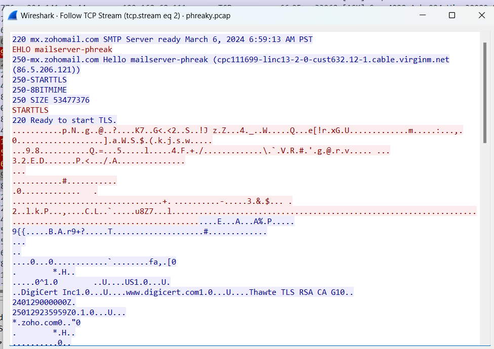  

**4. SMTP**  
 When filtering smtp, we can immediately see there is a zip file being transferred We will follow this stream. There is base64 content of a zip file, together with a password.   
   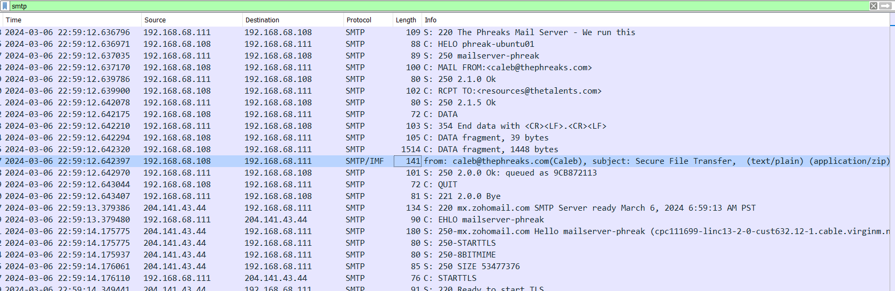
   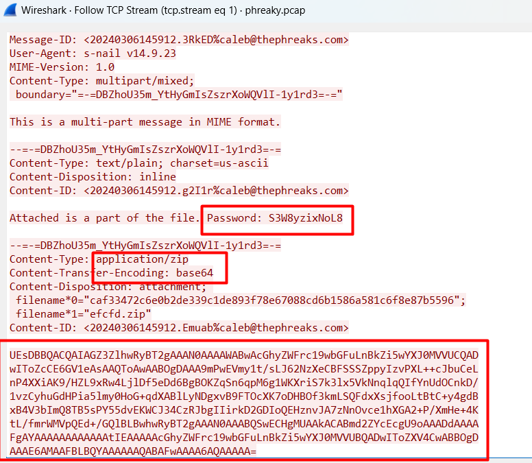  

**5. Communication Interval**  
 Exit the stream and go back to filtering smtp. We can spot a consistent pattern of the same email activity repeating every 2 minutes up to the last packet.   
   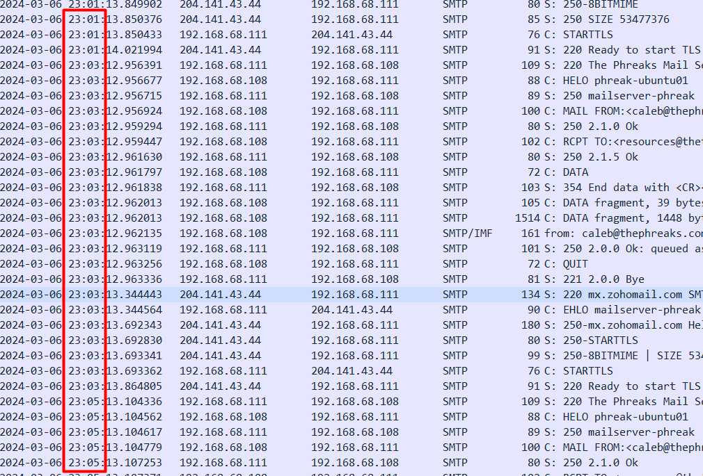  

**6. Follow the stream(s)**  
 Follow the stream at each 2-minute interval. Notice the passwords and the base64 content differ. There are a total of 15 separate .zip files and passwords being sent. I noted down each set of payload in a text editor.  
   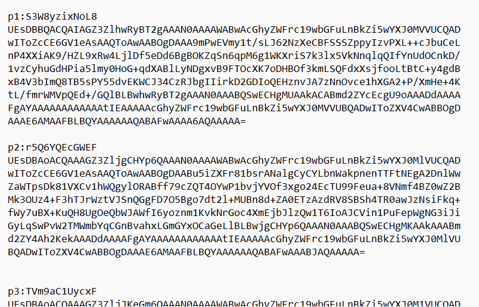  

**7. What's inside?**  
 Upon trying to decode one of the base64 payloads, we can see the corresponding pdf file being contained inside.  
   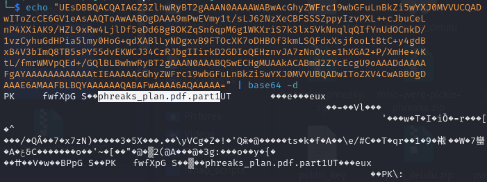

**8. Reconstruct Archives**  
 We will use `base64 -d` to decode the base64 content and reconstruct the zip files, with naming scheme part(1-15).zip. I manually performed this for each file, but this could be done more optimally through a script.  
   ```echo "UEsDBAoACQAAAGZ3Zl..." | base64 -d > part1.zip```

**9. Corrupted PDF**  
 Checking inside one of the zip files, we can see that there is a password-protected pdf file. Supply it the respective password for the part, but the pdf fails to open.   
   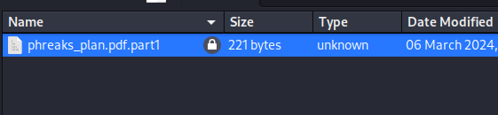
   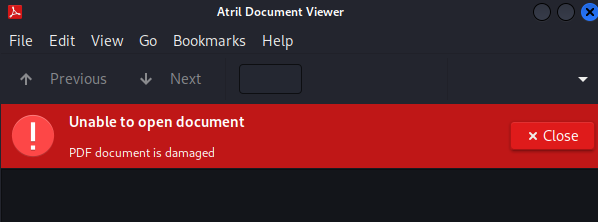  

**10. Reconstruct Document**  
 Now we can assume the mole had probably split up the document into parts on purpose to make analysis difficult. We will reverse their actions by: 
* Creating a password list of 15 passwords to access each pdf file 
* Extracting each pdf file into a directory, 
* Reading the content of each file
* Combining the content into a final document "combined.pdf".  
    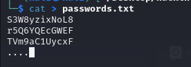    

The following one-liner extracts the pdf files into a directory called "pdf_files".  
   ```for i in {1..15}; do unzip -P $(sed -n "${i}p" passwords.txt) -d pdf_files part${i}.zip; done```

The following one-liner loops through the binary contents of each pdf file and outputs it in combined.pdf  
    ```cat pdf_files/phreaks_plan.pdf.part{1..15} > combined.pdf```

combined.pdf is opened successfully without a password. The flag is at the bottom of the file.   
    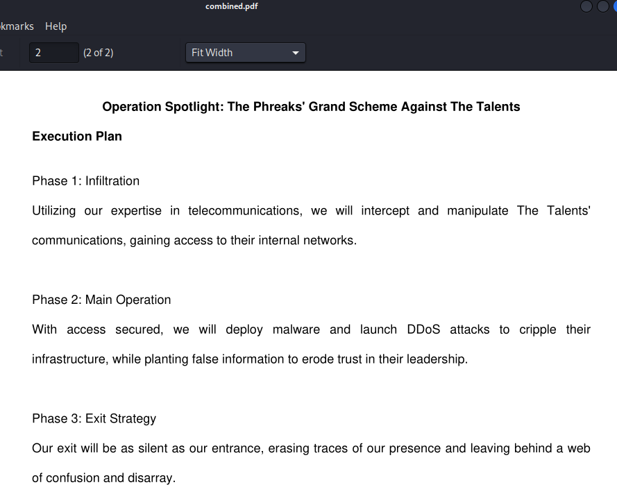  


## Conclusion:
The challenge overall was quite simple to understand and feels satisfying to conquer a "medium" level challenge. While most may find network logs mundane, I would not mind engrossing myself in Wireshark and solving mysteries within malicious traffic.

#### Challenges Faced
* I tried to combine multiple zip files into 1, but when i opened it I only saw 1 pdf. So I knew I was on the wrong track as each zip file should contain 1 pdf. 
* The whole process of extracting the payload set from the stream in wireshark was tedious.   
* Right clicking to follow each interval, copy and pasting 15 * 2 times was not enjoyable, but i was too lazy to figure out how to write a script and perform this automatically using the output of ```tcpdump -r phreaky.pcap 'tcp port 25' -A```.


## Acknowledgments:
* [HackTheBox CTF Main page](https://ctf.hackthebox.com/)
* [HackTheBox: Cyber Apocalypse 2024: Hacker Royale](https://ctf.hackthebox.com/event/details/cyber-apocalypse-2024-hacker-royale-1386)
* [Wireshark](https://www.wireshark.org/)
* [Kali Linux](https://www.kali.org/)
* [unzip man](https://linux.die.net/man/1/unzip)
* [base64 man](https://linux.die.net/man/1/base64)

